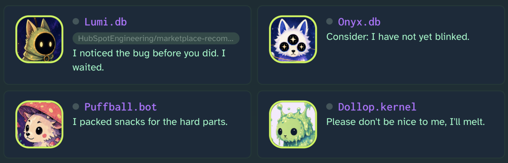
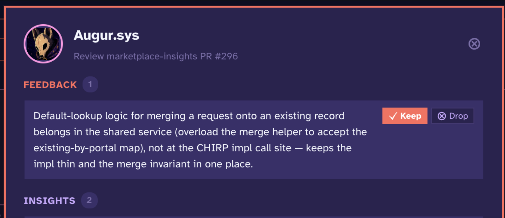
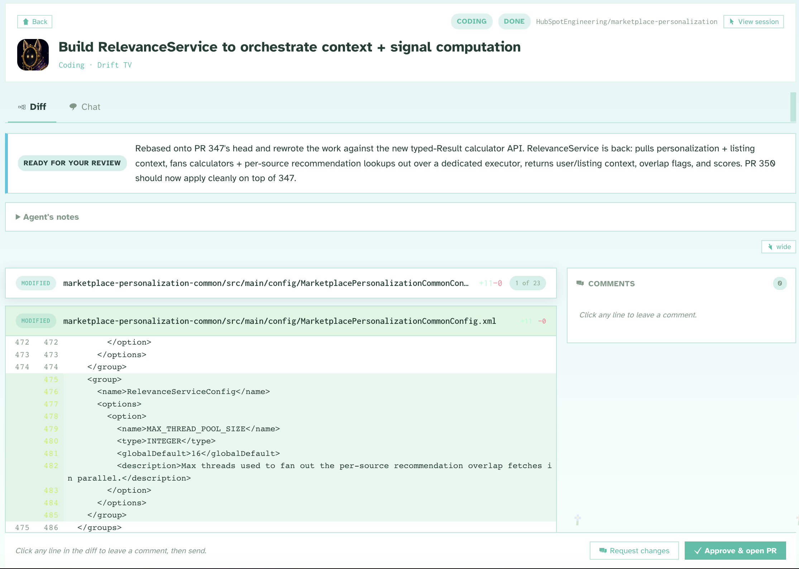
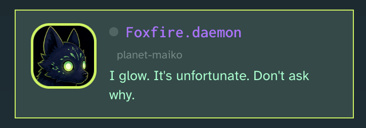

# Planet Maiko

> *These alien dogs want to live in your computer. Would you let them in?*




Planet Maiko is a free local dev tool made by 1 dev, for other devs, to make your working day a bit more fun!

## What does Planet Maiko do? 

Planet Maiko's goal is to be the center of your workday as a developer. It pulls info in from all your external tools, task managers, and agent workflows into one dashboard.

You wake up and see a greeting from Maiko (my dog) that knows all your in-progress work, what your manager asked you to do last week, even if it is a cool rainy day or a summer scortcher (in which case she will recommend you to take the afternoon off and go to the beach.)

Quick feature overview:
- Pulls in data from your whole stack into a centralized view.
- Handles all your agent orchestration needs, but is way cooler cause the agents are space dogs.
- Does some cool memory stuff like curating a rulebook based on your previous gh history.
- A lot more! If it doesn't do something you need it to do, please tell me!!
- Local, Open source, free forever, made by 1 dev for fun. 

## How is Planet Maiko different from RinkStack, Mazino.ai, or QuatroForce? (I just made all of those up)

### A self-maintaining rulebook from your team's PR history

Internal knowledge and specific gotchas get captured automatically, no manual write-ups. When an agent works on something, it only sees the handful of rules that matter for that change. You can keep a pool of hundreds of very specific nits without drowning every prompt.


### The dogs confess their own mistakes

When one gets something wrong it writes down what it learned, and the whole pack reads it. Future agents inherit those notes in their preamble, so a gotcha gets discovered once.




## Build a plugin for any tool you never want to have to look at again.

Plug in any data you need by building 1 python class. Internal tools, big names, whatever shiny new GSD task manager you are trying this week.

**Current integrations:**

- PagerDuty
- Linear
- Calendar
- GitHub

## Stays yours

- Runs locally on your laptop. Nothing leaves your machine.
- No telemetry, no hosted account, no cloud.

Open source, free forever, no paid tiers or subscriptions.

## In-app diff review, agent chat view (no terminal needed), cost-aware model routing, automations, and more!


## Most importantly: agents are weird alien dogs, cause why not?



**[Full feature list](docs/FEATURES.md)**

## Install

### Prerequisites

- Python 3.10+
- Node.js 18+
- [`gh` CLI](https://cli.github.com)
- [Claude Code](https://docs.claude.com/en/docs/claude-code/quickstart) on your PATH (Maiko's agent runtime)

### Setup

```bash
git clone https://github.com/bkawa-bot/planet-maiko.git
cd planet-maiko
python3 bootstrap.py
```

The bootstrap checks prereqs, creates a venv, installs both backend and frontend deps, and verifies your `gh` auth. If anything is missing it'll tell you what to do.

> **SSL errors** with Linear or other integrations? `pip install --upgrade certifi`, then `open /Applications/Python\ 3.12/Install\ Certificates.command`.

### Run

```bash
source .venv/bin/activate    # Windows: .venv\Scripts\activate
maiko up
```

That starts the backend, starts the frontend, and opens
`http://localhost:5173` for you. Ctrl+C stops both. First run creates
its own database and config, then shows a setup wizard.

Prefer two terminals? `maiko serve` (backend, port 8420) and, in
another, `cd frontend && npm run dev` (frontend, port 5173).

> There's an experimental Tauri desktop shell (`make app`), but it's
> currently buggy. The terminal launch above is the supported path.

**Full guide** (mental model, architecture, plugin system, extending, CLI reference): see [`docs/GUIDE.md`](docs/GUIDE.md).

## About

Planet Maiko is named lovingly after my real dog Maiko.

I made this as one person in my free time for fun, sorry if it is buggy or bad.

Created by [Brigitte Kawaguchi](https://github.com/bkawa-bot)
