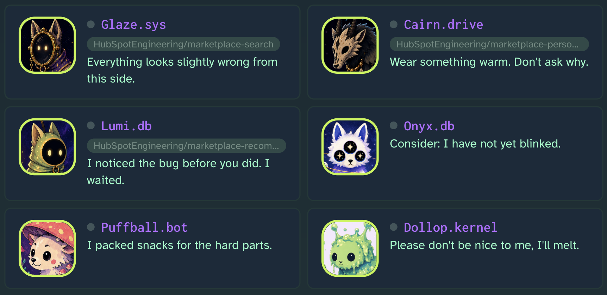
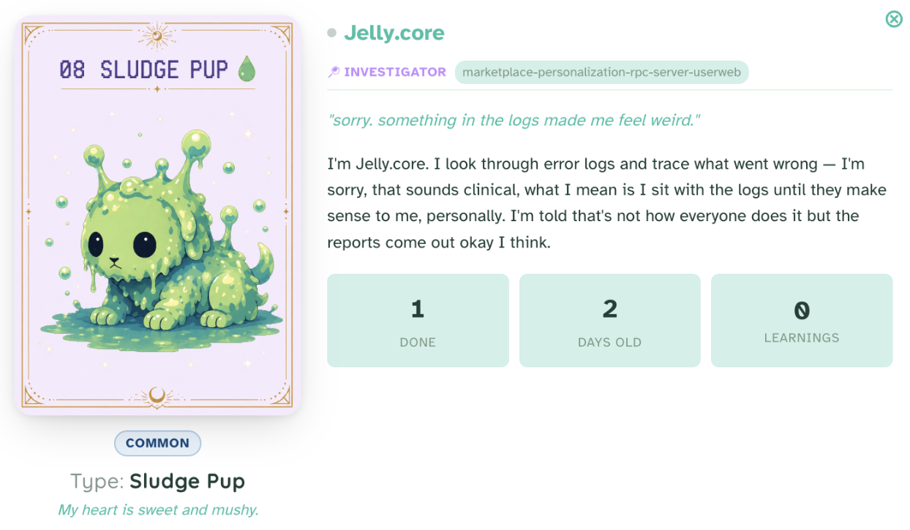
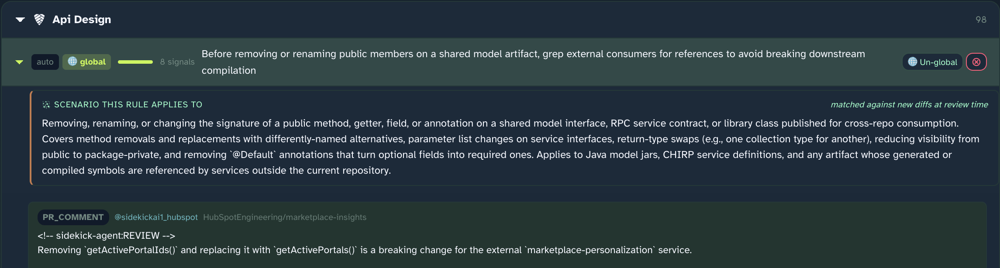
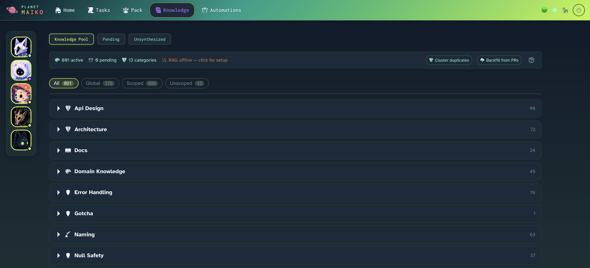
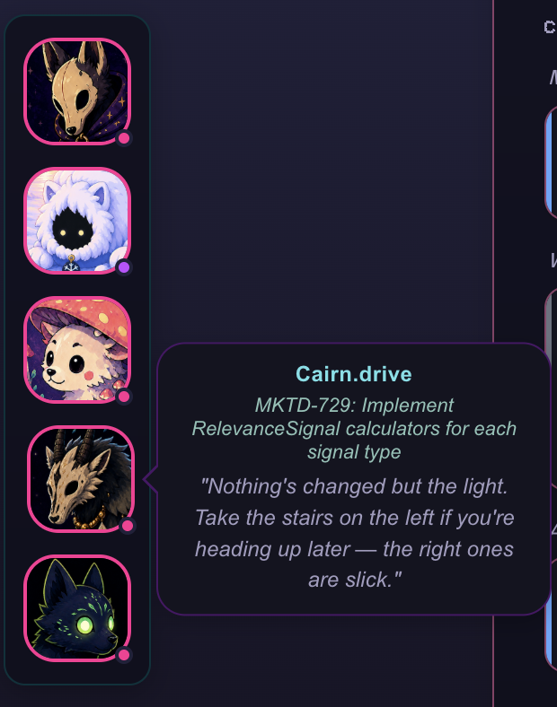

# Planet Maiko

#### *These alien dogs want to live in your computer. Would you let them in?*

### A local-first agent orchestrator where your AI agents are weird alien dogs that know a little too much. 

### Free forever, no paid tiers or subscriptions. Made by one dev for other devs.


---
> **IMPORTANT 5/14 UPDATE FOR CLAUDE USERS: MAIKO CAN BE CONFIGURED TO USE _INTERACTIVE_ CLAUDE SESSIONS. THIS MEANS IT WILL PULL FROM YOUR REGULAR SUBSCRIPTION, NOT AGENT SDK CREDITS.**

> **⚠️ Beta.** Planet Maiko is in active beta testing. Expect breaking changes, schema migrations, rough edges, and bugs. If you try it and something's broken, [file an issue](https://github.com/bkawa-bot/planet-maiko/issues/new).

---
We live in strange times, and yet our dev tools are so painfully un-strange. No one knows what being a software engineer will be like in a year, or even a month. If we are all tokenmaxxing to our own inevitable obsolescence, we might as well have fun.




## How is Planet Maiko different from RinkStack, Mazino.ai, QuatroForce? (I just made all of those up).

- #### Maiko has a unique self-maintaining memory system which builds a rule-book from you and your team's PR history and feedback. Internal knowledge and specific gotcha's are all automatically captured. No more manual write-ups of your team's guidelines needed.

- #### Maiko uses unique methods to get agents what they need without shoving 100 rules into every prompt.

- Semantically embeds learned guidelines keyed by what situations they are relevant to. Agents just need to describe what they are doing to get ONLY they need. This lets us have a pool of hundreds of very specific nits, rules, and context without overwhelming the agents.

-(EXPERIMENTAL) trains a local LoRA model based on what YOUR code looks like so your preferences are automatically applied on top of your coding agents.
-- This is experimental. I am still trying to figure out how to make it have less false positives. If you are smarter than me and this sounds interesting to you, lets talk!
-- Honestly this was made because Anthropic doesn't allow us to fine-tune Claude (unless you are Amazon 😉).




### **What (boring) stuff Planet Maiko does:**

### **What (boring) stuff Planet Maiko does:**

All the typical agent orchestration work. Automatically kicks off agents, lets them yell at each other (with Maiko as the mediator), agent task lifecycles, context sharing, etc.

### **What (COOL) stuff Planet Maiko does:**

#### Builds a rulebook from of all your (and your team's) past PR review mistakes for your agents to laugh at (use) so they don't make the same ones.
Backed by a local built-in RAG system using semantic embeddings. Agents just need to describe what they are doing in order to pull the relevant rules, so we don't have to stuff 300 rules into every prompt.





#### Maiko makes agents confess their own mistakes too. Everyone learns.

#### Build a plugin for any tool you never want to have to look at again.

I can no longer tolerate opening an app and having another new agent start yelling at me. I just figure out how to make Maiko deal with it instead.

**Current integrations:**
- PagerDuty
- Linear
- Calendar
- GitHub

#### Stays yours
- Runs locally on your laptop. Nothing leaves your machine.
- No telemetry, no hosted account, no cloud.

No venture capitalism, no productivity-maxxing (unless you want). I am not trying to make money. I don't care about maximizing the value you bring to your company. Planet Maiko is for you, not your company.

#### Most importantly: agents are weird alien dogs, cause why not?



### [Full feature list](docs/FEATURES.md)


## Install

### Prerequisites

- Mac OS
- Python 3.10+
- Node.js 18+
- `gh` CLI

### Install

```bash
git clone https://github.com/bkawa-bot/planet-maiko.git
cd planet-maiko

# Backend
python3 -m venv .venv
source .venv/bin/activate    # Windows: .venv\Scripts\activate
pip install -e .

# Frontend
cd frontend && npm install && cd ..
```

> **Mac users:** If you see SSL errors with Linear or other integrations, run `pip install --upgrade certifi`, then `open /Applications/Python\ 3.12/Install\ Certificates.command`.

### Run

Two terminals:

```bash
# Terminal 1, backend (port 8420)
source .venv/bin/activate
maiko serve

# Terminal 2, frontend (port 5173)
cd frontend && npm run dev
```

Open **http://localhost:5173** and walk through the setup wizard.

**Full guide** (mental model, architecture, plugin system, extending, CLI reference): see [`docs/GUIDE.md`](docs/GUIDE.md).

## About

Planet Maiko is named lovingly after my real dog Maiko.

I made this as one person in my free time for fun, sorry if it is buggy or bad.

Created by [Brigitte Kawaguchi](https://github.com/bkawa-bot)
