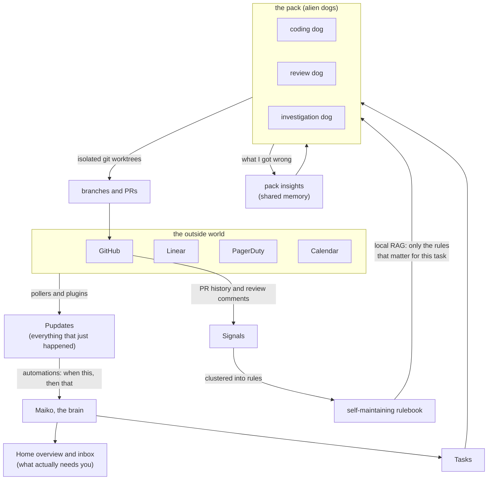

# Planet Maiko

> *These alien dogs want to live in your computer. Would you let them in?*

**A local-first agent orchestrator where your AI agents are weird alien dogs that know a little too much.**

Free forever, no paid tiers or subscriptions. Made by one dev for other devs.


---

> **⚠️ Beta.** Planet Maiko is in active beta testing. Expect breaking changes, schema migrations, rough edges, and bugs. If you try it and something's broken, [file an issue](https://github.com/bkawa-bot/planet-maiko/issues/new).

---

We live in strange times, and yet our dev tools are so painfully un-strange. No one knows what being a software engineer will be like in a year, or even a month. If we are all headed to our own inevitable obsolescence, we might as well have fun.


## What does Planet Maiko do? 

All the required agent orchestration work. Automatically kicks off agents, lets them yell at each other (with Maiko as the mediator), agent task lifecycles, context sharing... but also some more interesting features as well such as conflict detection, (experimental) fine-tuning, self-curated shared memory and insights etc

## How is Planet Maiko different from RinkStack, Mazino.ai, or QuatroForce? (I just made all of those up)

- **Maiko has a unique self-maintaining memory system** which builds a rule-book from you and your team's PR history and feedback. Internal knowledge and specific gotchas are all automatically captured. No more manual write-ups of your team's guidelines needed.
- **Maiko uses semantic embeddings to get agents what they need without shoving 100 rules into every prompt.** Agents just describe what they're doing and get ONLY the rules that matter, so you can keep a pool of hundreds of very specific nits and context without drowning every prompt.
- **The dogs confess their own mistakes too.** When one gets something wrong it writes down what it learned, and the whole pack reads it.

### How it actually works

The boring part is running agents. The interesting part is the loop on the right: your PR history quietly teaches the rulebook, and the rulebook only ever hands each dog the few rules that matter for what it is touching.



## Build a plugin for any tool you never want to have to look at again.

Plug in any data you need by building 1 python class. Internal tools, big names, whatever shiny new GSD task manager you are trying this week.

**Current integrations:**

- PagerDuty
- Linear
- Calendar
- GitHub

## Stays yours

- Runs locally on your laptop. Nothing leaves your machine.
- No telemetry, no hosted account, no cloud.

Open source, free forever, no paid tiers or subscriptions.

## In-app diff review, agent chat view (no terminal needed), cost-aware model routing, automations, and more!


## Most importantly: agents are weird alien dogs, cause why not?


**[Full feature list](docs/FEATURES.md)**

## Install

### Prerequisites

- macOS (or Linux/Windows for development)
- Python 3.10+
- Node.js 18+
- `gh` CLI
- Claude Code (the agent runtime), installed and on your PATH

### Setup

```bash
git clone https://github.com/bkawa-bot/planet-maiko.git
cd planet-maiko

python3 -m venv .venv && source .venv/bin/activate   # Windows: .venv\Scripts\activate
pip install -e .
cd frontend && npm install && cd ..

gh auth login    # GitHub: repo discovery + worktrees
```

> **SSL errors** with Linear or other integrations? `pip install --upgrade certifi`, then `open /Applications/Python\ 3.12/Install\ Certificates.command`.

### Run

One command:

```bash
maiko up
```

That starts the backend, starts the frontend, and opens
`http://localhost:5173` for you. Ctrl+C stops both. First run creates
its own database and config, then shows a setup wizard.

Prefer two terminals? `maiko serve` (backend, port 8420) and, in
another, `cd frontend && npm run dev` (frontend, port 5173).

> There's an experimental Tauri desktop shell (`make app`), but it's
> currently buggy. The terminal launch above is the supported path.

**Full guide** (mental model, architecture, plugin system, extending, CLI reference): see [`docs/GUIDE.md`](docs/GUIDE.md).

## About

Planet Maiko is named lovingly after my real dog Maiko.

I made this as one person in my free time for fun, sorry if it is buggy or bad.

Created by [Brigitte Kawaguchi](https://github.com/bkawa-bot)
