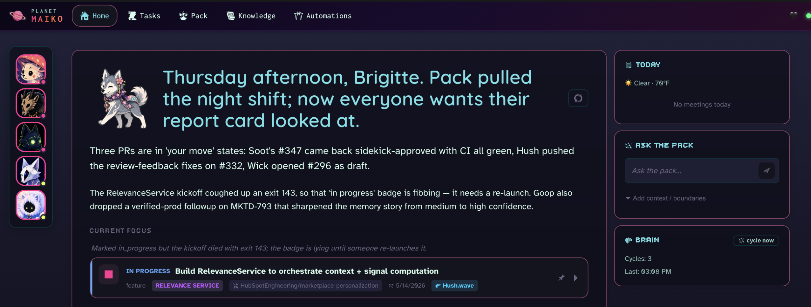

# Planet Maiko

**The current model of agent orchestration is unsustainable.**

*"Ship 40 PRs a day."* *"10x your output."* *"Run a swarm."* The cost never makes the screenshot — you end up working *for* your agents, not the other way around. Feeding context. Reviewing output. Resolving conflicts between siblings who don't know the others exist. A team of junior devs that never sleeps, never reads the room, and never learns what you taught them yesterday. Burnout, just wearing a new hat.



I got tired of being a babysitter.

So I built Planet Maiko. I've been a software engineer for almost a decade; this is the tool I wanted to exist, with one goal: bring a little joy back to the work day. Fewer agents to babysit, more space to think. I use it every day. Sharing it freely with anyone who wants it.

In Planet Maiko you lead a pack that teaches itself from your team's merged PRs, shares context between siblings, and coordinates automatically. You stop being a fleet manager and go back to being a lead engineer.

**You don't need more agents. You need smarter ones.**

### The pack that raises itself

- **Agents that learn your team's taste from every merged PR.** Reviewer feedback flows into per-repo LoRA adapters — no setup, no prompt engineering.
- **Every agent starts with the team's full playbook in hand.** Approved insights inject into every new agent's `CLAUDE.md` automatically — no hand-written guidelines, no copy-paste between sessions.
- **Siblings coordinate automatically — no more silent rewrites.** A2A conflict detection catches file and API overlap before two agents damage each other's work.
- **The pack improves together, every day.** Agents share learnings at the campfire, you approve what sticks, tomorrow's pack wakes smarter.


Cozy on the surface — Animal Crossing vibes, live weather, and a real Alaskan Klee Kai named Maiko who gets petted when you close out a good day. Uncompromising underneath — AGPL, anti-extraction, on your machine always. The only subscription is caring about your tools.

---


## What it's not

- **Not a swarm to command.** One conductor — you. The pack runs itself between your check-ins.
- **Not a SaaS.** Nothing leaves your machine. No telemetry, no hosted account, no logging in to someone else's server.
- **Not venture-backed.** AGPL, copyleft, permanent. Can't be acquired and repriced.
- **Not about making you more "productive."** It's about letting you do good work without being on-call to your own tools.

---

## Quick Start

### Prerequisites

- Python 3.10+
- Node.js 18+
- `gh` CLI (optional — for GitHub integration)
- [Claude Code](https://docs.claude.com/en/docs/claude-code/quickstart) (required for agent features)

### Install

```bash
git clone https://github.com/bkawa-bot/planet-maiko.git
cd planet-maiko

# Backend
python3 -m venv .venv
source .venv/bin/activate    # Windows: .venv\Scripts\activate
pip install -e .

# Frontend
cd frontend && npm install && cd ..

# Agent channel (real-time agent communication)
cd channel && npm install && cd ..
```

> **Mac users:** If you see SSL errors with Linear or other integrations, run `pip install --upgrade certifi`, then `open /Applications/Python\ 3.12/Install\ Certificates.command`.

### Run

Two terminals:

```bash
# Terminal 1 — backend (port 8420)
source .venv/bin/activate
maiko serve

# Terminal 2 — frontend (port 5173)
cd frontend && npm run dev
```

Open **http://localhost:5173** and walk through the setup wizard.

---

**Full guide** — mental model, architecture, plugin system, extending, CLI reference: see [`docs/GUIDE.md`](docs/GUIDE.md).

## License

Planet Maiko is [AGPL v3](LICENSE). In plain English:

- **Use it anywhere, solo or inside a company.** No strings.
- **Modify it for your team's own use.** AGPL asks that you share your source with anyone who uses your instance — when "anyone" means your coworkers, pointing them at your internal branch is enough. You don't have to publish anything to the world.
- **Build a paid product on top of it?** You must share your modifications under AGPL too. That's the anti-extraction intent — if someone commercializes Maiko, the community gets the improvements back.

Not legal advice, just the intent. If you're using Maiko to help yourself or your team, you're free. If you're selling it, share back.

Created by [Brigitte Kawaguchi](https://github.com/bkawa-bot) · Built with Claude
